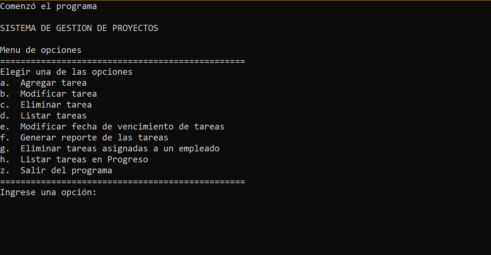

#Sistema de gestion de proyectos
##Proyecto realizado en la catedra Sintaxis y Semantica del Lenguaje

-Programa de Consola/Terminal
-Realizado con Python
-Se implemento el concepto de TAD
-Se trabajo con Estructuras de datos y Funciones.

